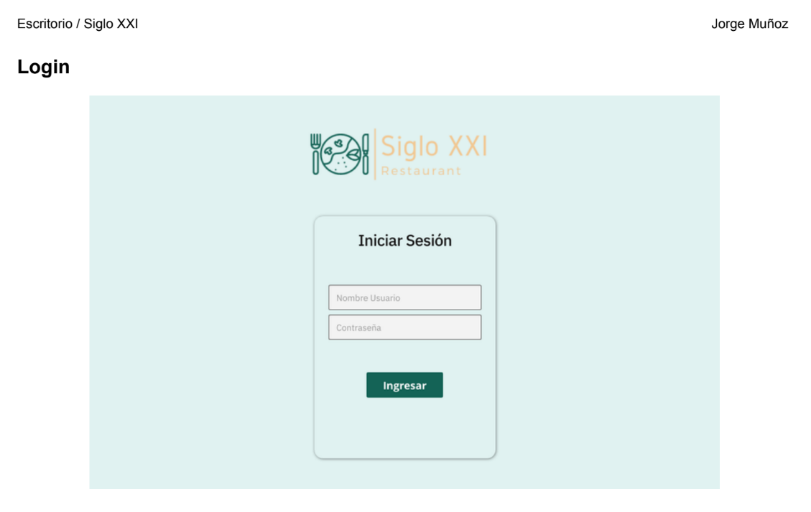
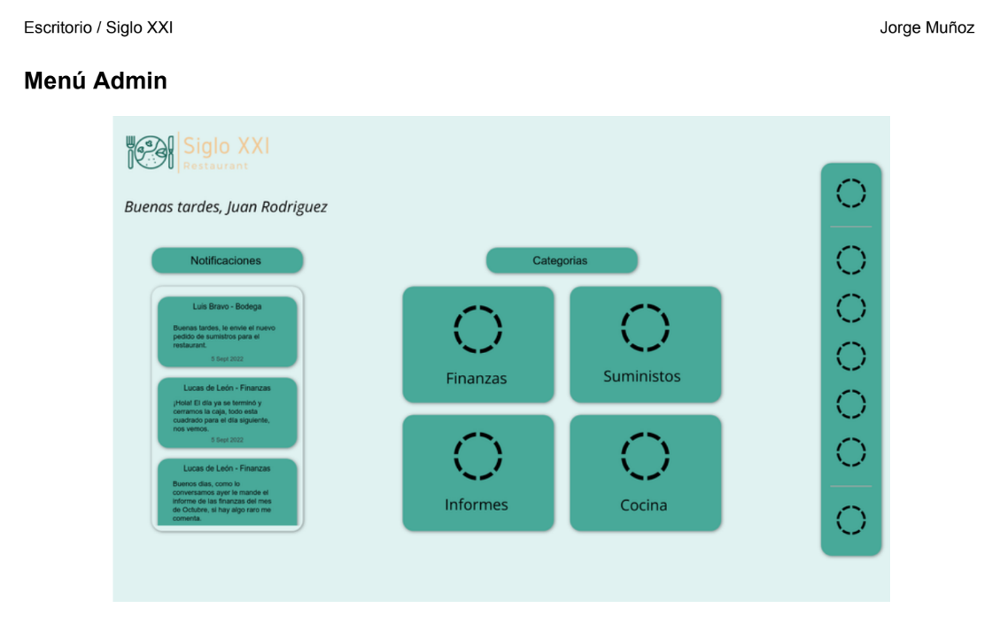
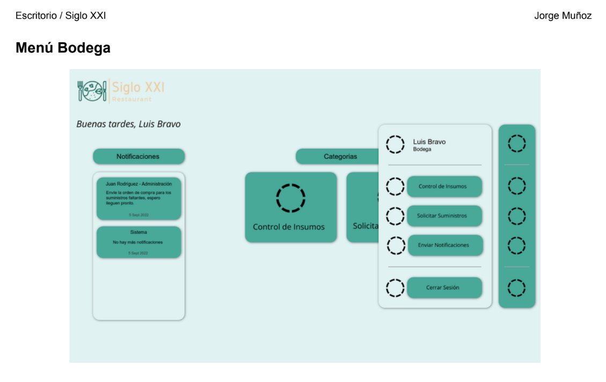
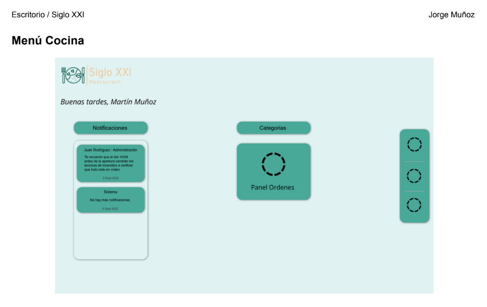
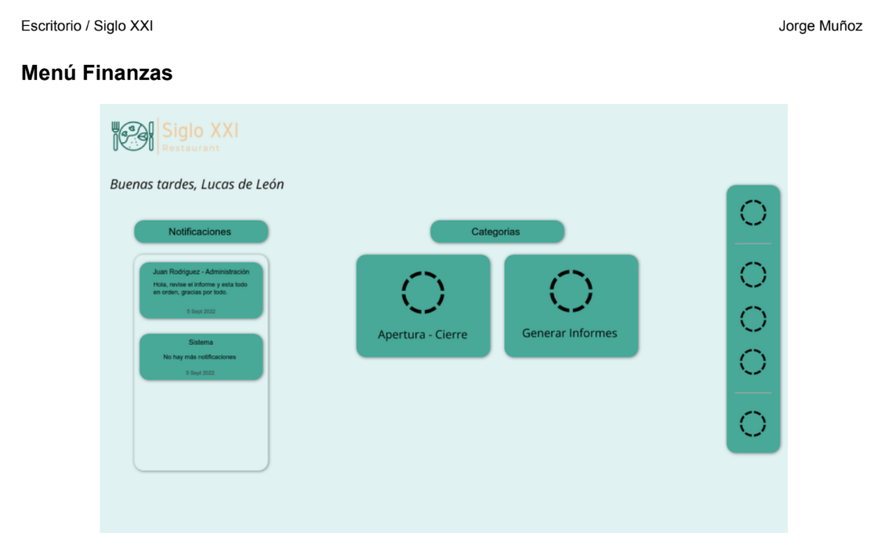

# 🍽️ Sistema Interno para Restaurante **Siglo XXI**

Este proyecto es un sistema interno diseñado para la gestión integral de un **Restaurante Ficticio** llamado **Siglo XXI**. Incluye funciones esenciales para el manejo de operaciones diarias, como la gestión de suministros, usuarios, pedidos, reportes y sistema de caja. Además, permite el envío automatizado de recibos por correo electrónico. 📧

## 📋 Tabla de Contenidos

- [⚙️ Estado del Proyecto](#️-estado-del-proyecto)
- [✨ Características](#-características)
- [🛠️ Tecnologías Utilizadas](#️-tecnologías-utilizadas)
- [🚀 Instalación](#-instalación)
- [📸 Imágenes del Proyecto](#-imágenes-del-proyecto)

---

## ⚙️ Estado del Proyecto

El sistema fue desarrollado como un proyecto de portafolio de título (similar a una tesis), por lo que **no está destinado a la venta**.

Actualmente, no se encuentra en producción, y la base de datos a la que estaba conectado **NO** está disponible. 🛠️ Sin embargo, el código sigue siendo funcional.

---

## ✨ Características

El sistema incluye las siguientes funcionalidades:
- 🛒 **Gestión de Suministros:** Registro, actualización y seguimiento de los suministros del restaurante.
- 👥 **Gestión de Usuarios:** Control de accesos y roles para administradores, cocineros y cajeros.
- 📊 **Sistema de Reportes:** Generación de informes sobre operaciones internas.
- 🧑‍🍳 **Gestión de Pedidos:** Asignación y seguimiento de pedidos para los cocineros.
- 💵 **Sistema de Caja:** Procesamiento de pagos y emisión de boletas.
- 📧 **Envío de Recibos:** Automatización del envío de recibos en formato HTML por correo electrónico.

---

## 🛠️ Tecnologías Utilizadas

Este proyecto fue desarrollado utilizando:
- 💻 **Backend:** C# con .NET Framework.
- 🎨 **Frontend:** XAML para la interfaz principal.
- 🗂️ **MVC (Model-View-Controller):** Patrón arquitectónico para una mejor organización del código.
- 📨 **HTML:** Formato para los recibos enviados por correo.
- 🗄️ **Base de Datos:** El proyecto utiliza conexión a base de datos MySQL, aunque actualmente esta conexión **NO** está disponible.

---

## 🚀 Instalación

### Requisitos previos
- 🛠️ Tener instalado **Visual Studio** con soporte para C# y .NET.
- ⚙️ Configurar una base de datos (actualmente no disponible, favor deshabilitar temporalmente las funciones que dependen de ella.)

## ⚠️ Importante

**El proyecto, al no contar con una conexión de base de datos activa, **NO** podrá funcionar con todas sus funcionalidades. Esto podría generar problemas al intentar acceder a las pantallas asociadas a cada tipo de usuario entre otros problemas.**

---

## 📸 Imágenes del Proyecto

**A continuación, se muestran capturas de pantalla que ilustran la interfaz del programa creado.**

